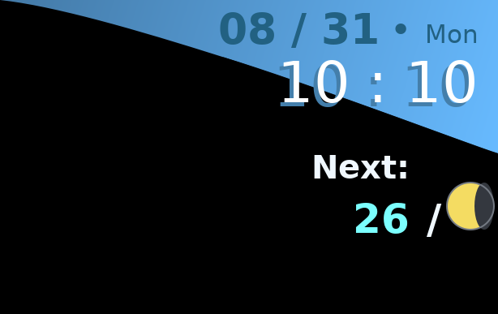

# Moonlight Clock for COSMIC

> **A shameless fork from [Moonlight Clock for Cinnamon](https://github.com/linuxmint/cinnamon-spices-desklets/tree/master/moonlight-clock@torchipeppo).**

A native Persona 3 inspired desktop widget for the COSMIC Wayland session. It
uses libcosmic and the layer-shell protocol to create a transparent,
undecorated surface on the desktop layer, so there is no application window or
title bar. It ports the original Cinnamon desklet's angled clock face, moon
phases, AMap or WeatherAPI data, custom countdowns, color schemes, fonts,
scaling, positioning, and English or Chinese labels.



The application is a single Rust binary. Iced Canvas draws the widget through
libcosmic's software renderer. There is no Python, GTK, Eww, X11 fallback,
configuration GUI, backend service, or application IPC socket.

## Requirements

- A COSMIC Wayland session
- A compositor providing `zwlr_layer_shell_v1` (provided by COSMIC)
- The system Wayland client library and `libxkbcommon.so.0`

## Run From This Checkout

```sh
cargo run --locked -- doctor
cargo run --locked -- run
```

This requires Rust 1.93 or newer. Left-click the clock to refresh weather data.

## Install

From a release archive:

```sh
tar -xzf moonlight-clock-cosmic-<version>-<architecture>.tar.gz
cd moonlight-clock-cosmic-<version>-<architecture>
./install.sh
```

This installs the native binary to `~/.local/share/moonlight-clock`, adds
`moonlight-clock` and `moonlight-clockctl` links under `~/.local/bin`, creates
the default configuration, and enables COSMIC XDG autostart. Log out and back
in to start the widget automatically. Run the installed `uninstall.sh` to
remove the application. User configuration is intentionally retained.

Running `./install.sh` from a source checkout builds a release binary first.

## Configure

Installation creates:

```text
~/.config/moonlight-clock/config.toml
```

See the fully commented [config.example.toml](config.example.toml) for every
setting. Changes are applied within one second, including output, position,
scale, layer, and weather settings. `scale` manually scales the complete
614x387 design for different display sizes; Wayland's output scale is handled
by the compositor.

Useful commands:

```sh
moonlight-clock doctor
moonlight-clock status
moonlight-clock refresh
moonlight-clock restart
moonlight-clock open-config
```

Weather modes support [AMap](https://lbs.amap.com/) and
[WeatherAPI](https://www.weatherapi.com/). AMap is the default for new
configurations and uses a city adcode such as `110000` for Beijing. The API key
is stored in the user-only configuration file and sent only to the selected
provider. AMap does not supply rain probability, so `mode = "weather-rain"`
displays `--` when AMap is selected.

## Credits And License

The original Moonlight Clock for Cinnamon is by torchipeppo. SunCalc-style moon
calculations follow Vladimir Agafonkin's
BSD-2-Clause implementation. This project is distributed under GPL-3.0-or-later;
see [LICENSE](LICENSE).
